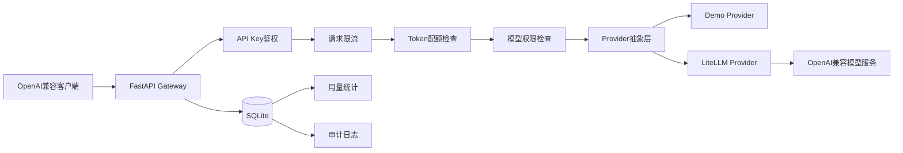

# ModelGate

ModelGate 是一个基于 FastAPI、LiteLLM 和 SQLite 实现的多租户大模型 API 网关，兼容 OpenAI Chat Completions 风格接口。

## 已实现功能

- API Key 鉴权
- 用户、应用和 API Key 管理
- 模型访问权限控制
- API Key 禁用与轮换
- 按 API Key 请求限流
- 月度 Token 配额
- 配额耗尽返回 HTTP 429
- 调用日志和 Token 用量统计
- 失败请求审计日志
- 配额响应头
- Swagger/OpenAPI 文档
- Demo Provider 与 LiteLLM Provider
- SQLite 持久化
- Docker Compose 配置

## 系统架构



## 环境要求

- Windows、Linux 或 macOS
- Python 3.13+
- Docker 为可选项

## 本地启动

```powershell
Set-Location F:\ModelGate
.\.venv\Scripts\Activate.ps1
python -m uvicorn app.main:app --host 127.0.0.1 --port 8000
```

打开 Swagger：

```text
http://127.0.0.1:8000/docs
```

## 环境变量

复制 `.env.example` 为 `.env`，再填写配置：

```text
DEMO_MODE=true
GATEWAY_MODEL_ID=deepseek-chat
LITELLM_MODEL=deepseek/deepseek-chat
LITELLM_API_KEY=
LITELLM_API_BASE=https://api.deepseek.com
LITELLM_TIMEOUT_SECONDS=60

AUTH_ENABLED=true
DEV_API_KEY=replace-with-a-random-admin-key
DATABASE_PATH=data/modelgate.db

RATE_LIMIT_REQUESTS=60
RATE_LIMIT_WINDOW_SECONDS=60
```

不要将真实 API Key 提交到 Git。

## API 示例

### 健康检查

```http
GET /health
```

### 查看模型

```http
GET /v1/models
Authorization: Bearer <modelgate-api-key>
```

### 查看当前身份

```http
GET /v1/whoami
Authorization: Bearer <modelgate-api-key>
```

### 聊天请求

```http
POST /v1/chat/completions
Authorization: Bearer <modelgate-api-key>
Content-Type: application/json
```

```json
{
  "model": "deepseek-chat",
  "messages": [
    {
      "role": "user",
      "content": "你好"
    }
  ],
  "temperature": 0.2,
  "stream": false
}
```

响应中包含：

- `usage.prompt_tokens`
- `usage.completion_tokens`
- `usage.total_tokens`
- `X-Request-ID`
- `X-Quota-Limit`
- `X-Quota-Used`
- `X-Quota-Remaining`

## 管理员接口

```text
POST /admin/users
POST /admin/applications
POST /admin/api-keys
POST /admin/api-keys/{key_id}/disable
POST /admin/api-keys/{key_id}/rotate
POST /admin/api-keys/{key_id}/quota
GET  /admin/api-keys/{key_id}/quota
GET  /admin/usage
GET  /admin/audit-logs
```

## 测试

运行全部测试：

```powershell
python -m pytest -v
```

当前结果：

```text
29 passed, 1 warning
```

测试覆盖：

- 鉴权
- 用户和应用管理
- API Key 禁用与轮换
- 模型权限
- 请求限流
- Token 配额
- 用量统计
- 审计日志
- 管理员接口
- 聊天接口

## Docker

项目提供：

- `Dockerfile`
- `docker-compose.yml`
- `.dockerignore`
- `.env.docker.example`

启动命令：

```powershell
docker compose up --build
```

Docker 配置使用命名卷持久化 SQLite 数据。

注意：当前开发机未安装 Docker，因此容器构建尚未在本机验证。

## 真实模型联调

已通过 LiteLLM 接入 DeepSeek OpenAI 兼容接口，并验证：

```text
prompt_tokens: 15
completion_tokens: 7
total_tokens: 22
```

## 项目亮点

- 通过 Provider 抽象隔离 Demo 模型和真实模型供应商。
- 使用 API Key、用户和应用实现多租户身份隔离。
- 通过限流和 Token 配额控制调用成本。
- 通过 SQLite 记录用量与审计数据。
- 支持 API Key 禁用和安全轮换。
- 使用 29 项自动化测试验证核心链路。